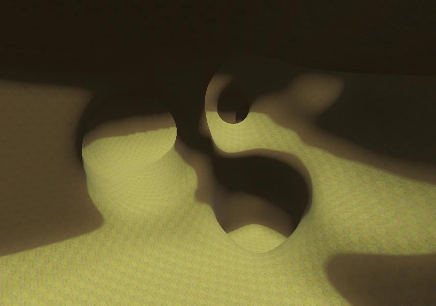
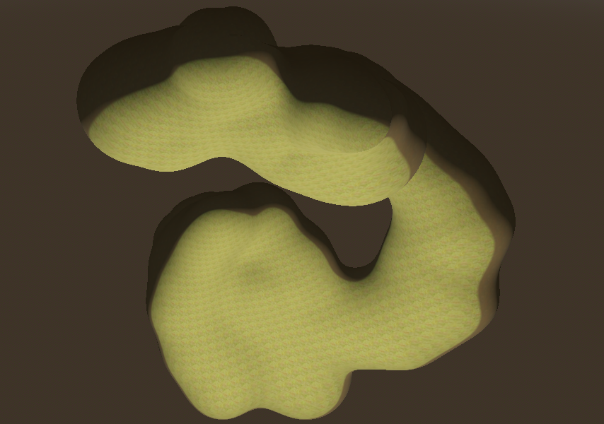

# CaveEditor
3D Cave editor using [Godot v4.1](https://godotengine.org/) and [godot_voxel module](https://github.com/Zylann/godot_voxel). However, for now, modified version of godot_voxel module is used, which can be found [here](https://github.com/Piratux/godot_voxel).




## Features
- Edit terrain tools:
  - Sphere.
  - Cube.
  - Blend ball.
  - Surface.
  - Flatten.
- Terrain changes are automatically saved in a file.
- World manager that allows to have multiple worlds.
- Terrain mesh export (only exports loaded area around the camera).

## Project binary releases
Windows:
- https://github.com/Piratux/CaveEditor/releases/latest <br />

<!-- TODO: update this when official module is used, instead of modified version -->
<!-- ## Running the project from editor
- Download files from this repository.
- Download compiled godot editor with module.
  - On Windows, download editor from here https://github.com/Zylann/godot_voxel/actions/runs/4724932919 named 
`godot.windows.editor.x86_64.exe`.
  - On Linux, download editor from here https://github.com/Zylann/godot_voxel/actions/runs/4724932921 named `godot.linuxbsd.editor.x86_64`.
  - On other platforms or architectures, you will need to compile godot with the module yourself (see https://voxel-tools.readthedocs.io/en/latest/getting_the_module/).
- Run the godot editor.
- When Godot's project manager opens up, import the project (this only needs to be done once).
  - Click `Import`
  - Click `Browse`
  - Locate `CaveEditor/project.godot`
  - Click `Open`
  - Click `Import & Edit`
- When Godot's editor loads up, press F5 or click `Run project` button on the top right to run the project. -->

## Building from source
Guide how to build from source:
- Get following repositories (in the future I should use Godot stable versions instead):
  - https://github.com/godotengine/godot/tree/4.2
  - https://github.com/Zylann/godot_voxel/commit/e892c38f4d39d65b8b51c1872798b43366938a8a
- Follow compilation guide here:
  - https://voxel-tools.readthedocs.io/en/latest/getting_the_module/#building-yourself
- Then build both Godot versions. For simplicity, setup exact folder copy, then run each command in each folder copy:
  - Build Godot editor:
```
scons platform=windows
```
  - Build Godot template release (required to create final standalone executable):
```
scons platform=windows target=template_release
```
