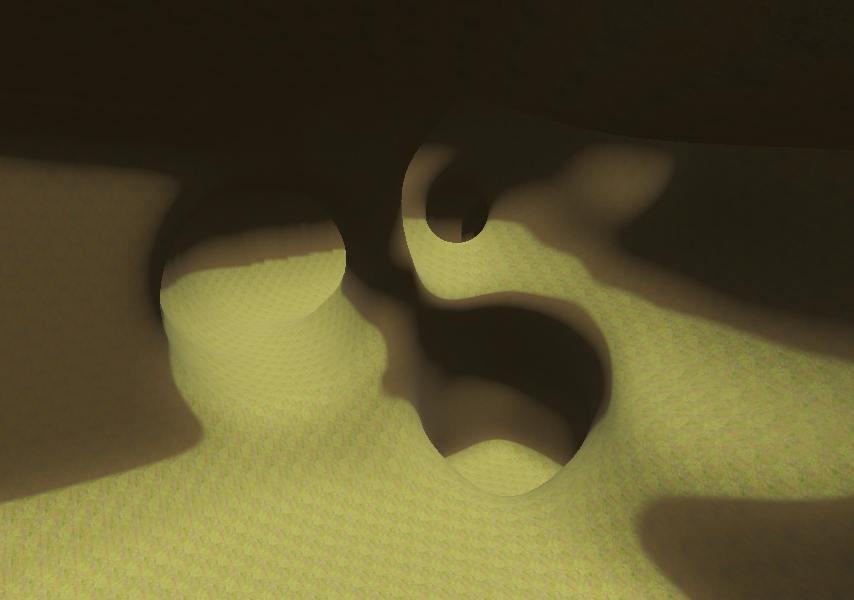
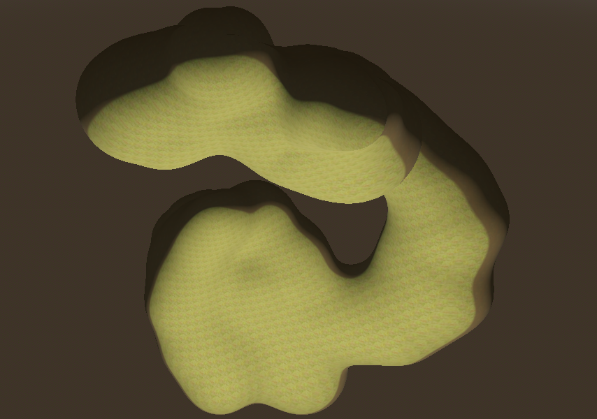
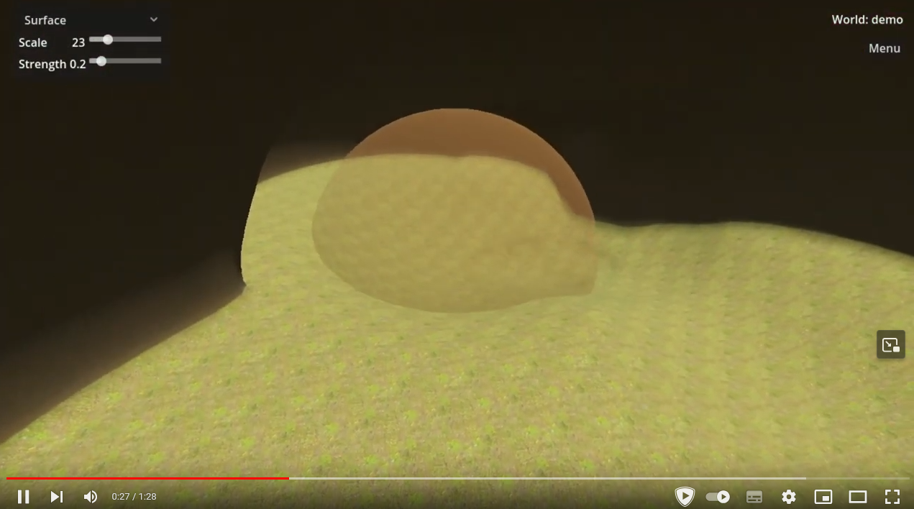

# CaveEditor
3D Cave editor using [Godot v4.2.2](https://godotengine.org/) and [godot_voxel module v1.2.0](https://github.com/Zylann/godot_voxel).





(https://youtu.be/Ss2c8Ry2Hfo)

## Features
- Edit terrain tools:
  - Sphere.
  - Cube.
  - Blend ball.
  - Surface.
  - Flatten.
  - Mesh.
- Terrain changes are automatically saved in a file.
- World manager that allows to have multiple worlds.
- Terrain mesh export (only exports loaded area around the camera).

## Project binary releases
Windows:
- https://github.com/Piratux/CaveEditor/releases/latest

## Running project
This contains information on how to run project if you want to make changes to Cave Editor source code or run project on non-Windows platforms:
- Download Godot editor from [here](https://github.com/Zylann/godot_voxel/releases/tag/v1.2.0).
- Download source code of this repository.
- Run downloaded Godot editor
- Open up directory that contains `project.godot` from source code.

## Building from source
This contains information on how to build C++ code if you want to make changes to Godot or voxel module source code:
- Get following repositories:
  - Godot 4.2.2 stable: https://github.com/godotengine/godot/releases/tag/4.2.2-stable
  - Godot voxel module 1.2.0: https://github.com/Zylann/godot_voxel/releases/tag/v1.2.0
- Follow compilation guide here:
  - https://voxel-tools.readthedocs.io/en/latest/getting_the_module/#building-yourself
- Then build Godot editor and template versions. For simplicity, setup exact folder copy, then run each command in each folder copy.
- Build Godot editor:
```
scons
```
  - Build godot editor with debug symbols enabled (optional):
```
scons dev_build=yes
```
  - Build Godot template release (required to create final standalone executable):
```
scons target=template_release
```

### Helper script to setup build from source
https://github.com/Piratux/godot-voxel-setup

## Creating standalone executable
For windows, download template file from [here](https://github.com/Zylann/godot_voxel/releases/download/v1.2.0/godot.windows.template_release.x86_64.exe.zip) and put it in folder `Templates`. Then open command line in the same directory as `project.godot` exists and type following:
```
<path\to\godot.exe> --headless --export-release "Windows Desktop" "Export/CaveEditor_v1.2.0.exe"
```
